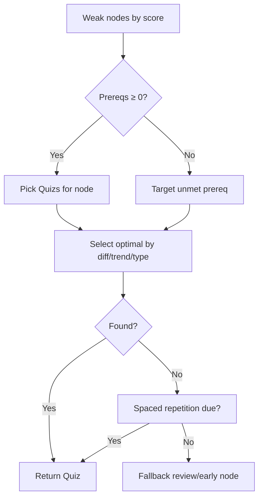
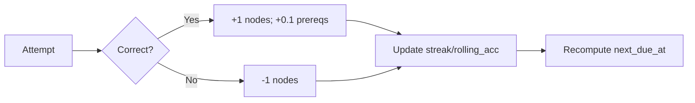

## Quiz Suggestion Engine — Technical Software Specification

### Overview

Build a Python-based adaptive Quiz Suggestion Engine that personalizes Quiz selection using a graph-structured KnowledgeGraph and per-learner UserProfile. The engine targets weaknesses, respects prerequisites, adapts difficulty, and schedules reviews via spaced repetition to ensure durable mastery.

### Goals

- Recommend the “next best” Quiz grounded in prerequisite mastery and individual progress.
- Reinforce weak or newly learned concepts and maintain mastered ones via spaced repetition.
- Scale to knowledge graphs with 1000+ nodes and large Quiz banks.
- Provide a clean API, strong validation, and comprehensive tests.

### Non-Goals

- Authoring tools for content/Quiz creation.
- Full UI; this is a backend engine.
- Advanced personalized NLP generation of Quizs (assume given Quiz bank).

---

## Architecture Overview

- Core models built with Pydantic for validation.
- KnowledgeGraph backed by Neo4j.
- SuggestionEngine orchestrates:
  - Weakness detection
  - Prerequisite validation
  - Difficulty adaptation
  - Spaced repetition scheduling
  - Fallback logic
- ScoringSystem updates scores and schedules after each attempt.
- Pluggable policy points for selection heuristics and review scheduling.

---

## Implementation Structure

The engine will live under research/core to align with existing packaging and Neo4j client usage. New modules are added without breaking current CLIs.

- research/
  - core/
    - clients/
      - neo4j_client.py (existing)
    - models/
      - knowledge_graph.py (Neo4j-backed wrapper: prereq/dependent traversals, guards)
      - user_profile.py (Pydantic model + serialization helpers)
      - Quiz.py (Pydantic model for Quiz/Choice)
    - engine/
      - suggestion_engine.py (selection policy, prereq checks, spaced repetition hooks)
      - scoring_system.py (score deltas, mastery thresholds, scheduling updates)
      - policies.py (tunable heuristics and constants)
    - utils/
      - graph_traversal.py (Neo4j queries for prerequisites/dependents with caching)
      - schedule.py (interval calculations, streak handling)
    - adaptive_cli.py (playable/testing CLI using SuggestionEngine)
    - quiz_cli.py (existing random quiz CLI retained)
  - spec/
    - Quiz_recommendation.md (this spec)
  - README.md (live KG schema summary; generated via schema CLI)

A lightweight schema/summary CLI will also be provided to introspect the current Neo4j database and write a summary into research/README.md.

## Data Models and Structures

### KnowledgeGraph

- Directed graph of concept nodes with edges representing prerequisites (edge u→v means u is a prerequisite of v).
- Efficient traversal for ancestors (prereqs) and descendants (dependents).
- Cycle detection on load.

Key methods:

- add_node(node_id: str, metadata: dict = None)
- add_edge(prereq_id: str, node_id: str)
- get_prerequisites(node_id: str, include_indirect: bool = True) -> set[str]
- get_dependents(node_id: str, include_idirect: bool = True) -> set[str]
- is_acyclic() -> bool; assert_acyclic() -> None
- topological_order() -> list[str]
- immediate_prerequisites(node_id) -> set[str]

Signature excerpt:

```python mode=EXCERPT
class KnowledgeGraph(BaseModel):
    graph: nx.DiGraph
    def get_prerequisites(self, node_id: str, include_indirect=True) -> set[str]: ...
    def immediate_prerequisites(self, node_id: str) -> set[str]: ...
```

### UserProfile

- Scores: Dict[node_id -> float], negative=weakness, 0=unlearned, positive=mastery level.
- Scheduling for spaced repetition: per-node last_seen_at, next_due_at, success_streak, lapses, rolling_accuracy.
- Metadata: user_id, last_updated, learning_streak, recent_attempts buffer.

Signature excerpt:

```python mode=EXCERPT
class UserProfile(BaseModel):
    user_id: str
    scores: dict[str, float] = Field(default_factory=dict)
    last_updated: datetime = Field(default_factory=datetime.utcnow)
```

Note: Internal scheduling fields (stored per node_id):

- schedule[node_id]: {last_seen_at: datetime, next_due_at: datetime, success_streak: int, lapses: int, rolling_acc: float}

### Quiz

- Quiz metadata and alignment with concepts.

Signature excerpt:

```python mode=EXCERPT
class QuizType(Enum): MC = "multiple_choice"; FIB = "fill_in_blank"
class Quiz(BaseModel):
    id: str; linked_nodes: list[str]; Quiz_type: QuizType
```

Content fields (examples):

- content.stem: str
- content.choices: list[str] (optional)
- content.answer: Any
- difficulty_level: int [1..5]
- metadata: tags, estimated_time, source, language

---

## Core Algorithms

### Selection Policy (high-level)

1. Construct ordered candidate node list:
   - Primary: nodes sorted by score ascending (most negative first).
   - Exclude mastered nodes (score ≥ 3) from primary queue.
2. For each candidate node:
   - If all prerequisites have score ≥ 0, select Quizs for node.
   - Else, push unmet prerequisites (score < 0) as priority targets.
3. Within node’s Quiz set, select optimal Quiz:
   - Difficulty adaptation (recent performance trend):
     - Poor trend → lower difficulty; improving trend → moderate; strong trend (<3 mastery) → higher difficulty within [1..5].
   - Variety: rotate Quiz types to reduce fatigue.
   - Novelty: avoid recently seen Quizs.
4. If no learning candidates:
   - Use spaced repetition pool for nodes with 1 ≤ score < 3 that are due.
5. Fallbacks:
   - If still empty, select light review from mastered nodes (score ≥ 3) due for long-interval review.
   - If no due reviews, pick topologically early unlearned node with available Quizs.

Decision Flow (simplified):



### Weakness Detection

- Sort user_profile.scores.items() by score ascending.
- Treat missing scores as 0.

### Prerequisite Validation

- All immediate prerequisites must have score ≥ 0.
- Optional: block if any indirect prereq < 0 (configurable).
- For multi-node Quizs: require union of all prereqs across linked nodes to be met.

### Quiz Selection Heuristics

- Input: suitable_Quizs for target node, recent performance (last k attempts), node score.
- Difficulty mapping (example):
  - score ≤ -1 or accuracy < 50% → difficulty 1–2
  - score in [0,1] or accuracy 50–70% → difficulty 2–3
  - score in [2] or accuracy 70–85% → difficulty 3–4
  - close to mastery (<3) → difficulty 4–5
- Tie-breaking:
  - Prefer Quiz types not used in last n attempts.
  - Prefer Quizs covering additional weak adjacent nodes.
  - Randomized choice with seeded RNG for reproducibility.

### Spaced Repetition Scheduling

- Maintain per-node next_due_at using a simplified SM-2-inspired schedule keyed to score and success_streak.
- Example intervals: base = [1d, 3d, 7d, 14d, 30d, 60d, 120d]; pick by min(score_index, streak_index), adjusted by rolling accuracy.
- Nodes with 1 ≤ score < 3 enter short-cycle review; score ≥ 3 enter long-cycle review.
- Lapse (incorrect) resets streak and shortens interval; correct increases streak and lengthens interval.

---

## Score Management System

### Update Rules (per attempt)

- Correct:
  - +1.0 to all Quiz.linked_nodes
  - +0.1 to each immediate prerequisite of those nodes (once per unique prereq)
- Incorrect:
  - −1.0 to all Quiz.linked_nodes
  - 0 penalty to prerequisites
- Bound scores within [-5, +10] to avoid unbounded drift.
- Mastery threshold: score ≥ +3
- Review trigger: schedule due when score in [1..2]

Flow (simplified):



API function signature:

```python mode=EXCERPT
def update_scores(profile: UserProfile, q: Quiz, is_correct: bool) -> UserProfile: ...
```

---

## API Interface Requirements

Public functions:

```python mode=EXCERPT
def suggest_next_quiz(p: UserProfile, kg: KnowledgeGraph, qs: list[Quiz]) -> Quiz: ...
def update_scores(p: UserProfile, q: Quiz, is_correct: bool) -> UserProfile: ...
```

```python mode=EXCERPT
def get_learning_progress(p: UserProfile, kg: KnowledgeGraph) -> dict: ...
def reset_user_progress(p: UserProfile, node_ids: list[str] | None = None) -> UserProfile: ...
```

Behavioral notes:

- suggest_next_Quiz raises NoQuizAvailableError if no candidates after fallbacks.
- get_learning_progress returns:
  - mastered_nodes, in_progress_nodes, weak_nodes
  - coverage stats (% nodes with score > 0)
  - next_due_reviews count
- reset_user_progress zeroes scores/schedules for specified nodes or all.

---

## Detailed Method Signatures

KnowledgeGraph core:

- get_prerequisites(node_id, include_indirect=True) -> set[str]
- immediate_prerequisites(node_id) -> set[str]
- get_dependents(node_id, include_indirect=True) -> set[str]
- has_node(node_id) -> bool
- validate_nodes_exist(node_ids: Iterable[str]) -> None
- assert_acyclic() -> None

SuggestionEngine core:

- select_optimal_quiz(candidates: list[Quiz], profile: UserProfile, node_id: str) -> Quiz
- suggest_review_quiz(profile: UserProfile, kg: KnowledgeGraph, qs: list[Quiz]) -> Quiz
- get_due_review_nodes(profile: UserProfile, now: datetime) -> list[str]

ScoringSystem core:

- apply_correct(profile, node_ids: list[str]) -> None
- apply_incorrect(profile, node_ids: list[str]) -> None
- bump_prereqs(profile, kg, node_ids: list[str], delta: float = 0.1) -> None
- update_schedule(profile, node_id: str, is_correct: bool, now: datetime) -> None

Utilities:

- compute_prereq_blockers(profile, kg, node_id) -> set[str]
- recent_performance(profile, node_id, k=10) -> dict[str, Any]

---

## Database/Storage Schema

Target: lightweight local JSON or SQLite-backed persistence. Pydantic models serialize naturally to JSON; SQLite enables queryable history and analytics.

Option A: JSON (simple)

- users/{user_id}.json:
  - scores: {node_id: float}
  - schedule: {node_id: {last_seen_at, next_due_at, success_streak, lapses, rolling_acc}}
  - recent_attempts: list[{ts, Quiz_id, linked_nodes, is_correct}]

Option B: SQLite (scalable)

- tables:
  - users(user_id TEXT PK, last_updated DATETIME, learning_streak INT)
  - scores(user_id TEXT, node_id TEXT, score REAL, PRIMARY KEY(user_id, node_id))
  - schedules(user_id TEXT, node_id TEXT, last_seen_at DATETIME, next_due_at DATETIME, success_streak INT, lapses INT, rolling_acc REAL, PRIMARY KEY(user_id, node_id))
  - attempts(id INTEGER PK, user_id TEXT, Quiz_id TEXT, ts DATETIME, is_correct INT)
  - Quizs(id TEXT PK, json TEXT)
  - kg_nodes(node_id TEXT PK, json TEXT)
  - kg_edges(src TEXT, dst TEXT, PRIMARY KEY(src, dst))

Indexes:

- schedules(next_due_at), attempts(user_id, ts), scores(user_id, score)

---

## Error Handling and Edge Cases

- GraphErrors:
  - CycleDetectedError on load or add_edge (prevent or refuse).
  - MissingNodeError if node_id not found in KG.
- SelectionErrors:
  - NoQuizAvailableError if no Quiz can be suggested after fallbacks.
- Validation:
  - Pydantic validation for enums, ranges (difficulty_level ∈ [1,5]), non-empty linked_nodes.
- Edge cases:
  - Empty score dict: treat as 0 (unlearned).
  - Multi-node Quizs: ensure combined prerequisites met; scoring applies to all linked nodes.
  - Conflicting difficulty signals: prefer lower difficulty if recent accuracy < threshold.
  - Time skew: if next_due_at in past by large margin, cap batch size via max daily reviews.
- Configurable via constants/env:
  - MASTERY_THRESHOLD=3.0, SCORE_BOUNDS=(-5, 10), PREREQ_BONUS=+0.1, ATTEMPT_HISTORY_LEN=200, MAX_DUE_REVIEWS_PER_SUGGESTION=1

---

## Performance Requirements and Optimizations

- Must handle ≥1000 nodes, ≥100k edges, ≥100k Quizs.
  Optimizations:
- Precompute and cache:
  - immediate prereqs/dependents maps
  - transitive closure (or memoized DFS) with LRU cache
  - per-node candidate Quiz lists (by node_id, difficulty, type)
- Use topological order once per session; reuse.
- Use set operations for prereq checks; avoid repeated NetworkX traversals.
- Batch schedule updates during high-throughput sessions.
- Complexity targets:
  - suggest_next_Quiz: O(log Q_node + P) average, where Q_node is candidate count for a node, P is prereq checks (set membership).
  - update_scores: O(L + P_immediate), L=linked_nodes.

---

## Testing Strategy and Acceptance Criteria

Testing stack: pytest, hypothesis (optional), freezegun for time.

Fixtures:

- Small KG with known prerequisites (e.g., A→B→C, D→E).
- Synthetic Quizs per node with varying difficulty/types.
- User profiles covering edge states (all zeros, mixed negatives, near mastery).

Tests:

- KnowledgeGraph: add/get, cycle detection, prereq traversal correctness.
- Selection:
  - Prioritizes negative scores first.
  - Blocks concept when any prerequisite < 0.
  - Falls back to unmet prerequisite Quizs when needed.
  - Difficulty adapts to trends (simulate attempts).
  - Spaced repetition chooses due reviews when no learning candidates.
  - Fallback review when no due items.
  - Multi-node Quizs respect combined prereqs and score updates apply to all.
- Scoring:
  - Correct/incorrect deltas, bounds, prereq bonus only on correct.
  - Mastery threshold recognition and scheduling changes across boundary.
- Performance:
  - Large synthetic graph (1k+ nodes) smoke test under time budget.
- API:
  - update_scores idempotency per single call.
  - reset_user_progress for subset/all.
- Error handling:
  - NoQuizAvailableError path, MissingNodeError, validation errors.

Acceptance criteria:

- All tests passing locally.
- Selection respects prerequisites and weakness-first policy.
- Difficulty adjusts plausibly to simulated trends.
- Review scheduling behaves: streaks increase intervals; lapses shorten.
- Handles 1000+ node graphs within target latency (e.g., <50ms per suggestion on warm cache in local tests).

---

## Deployment and Integration Guidelines

Language/Deps:

- Python 3.8+
- Dependencies:
  - networkx>=3
  - pydantic>=1.10,<3 (or v2—specify and adapt BaseModel)
  - pytest, freezegun (dev)
- Packaging:
  - src-layout package; expose public API via **init**.py
- Configuration:
  - Central config module for thresholds, bounds, scheduling intervals, RNG seed.
- Logging:
  - Use standard logging; INFO for suggestion decisions, DEBUG for scoring deltas, WARN for fallbacks and errors.
- Observability:
  - Optional hooks to emit events (suggestion_made, score_updated).
- Integration:
  - Suggestion API designed to be stateless; caller passes UserProfile, receives updates, then persists.
  - Provide serialization helpers for UserProfile and Quiz.

---

## Documentation

- Type hints and docstrings on all public functions/classes (Google/NumPy style).
- Examples:
  - Minimal usage: build KG, create UserProfile, add Quizs, call suggest_next_Quiz, then update_scores.

Example usage (abridged):

```python mode=EXCERPT
q = suggest_next_Quiz(profile, kg, Quiz_bank)
profile = update_scores(profile, q, is_correct=True)
```

---

## Security and Privacy

- No PII beyond user_id; avoid storing raw content beyond needed fields.
- If persisting attempts, store timestamps in UTC; consider anonymized IDs if external syncing.

---

## Future Extensions

- Weighted edges with prerequisite strength; partial credit scaling.
- A/B testing for selection heuristics.
- Multi-skill IRT-like modeling to refine difficulty adaptation.
- Content diversity constraints (interleave topics).
- Group analytics and teacher dashboards.

---

## Appendix: Core Policies (Config Defaults)

- Mastery threshold: 3.0
- Score increment/decrement: +1.0 / −1.0
- Prerequisite bonus: +0.1 (correct only, immediate prereqs)
- Score bounds: [−5, +10]
- Review windows (SM-2-like base days): [1, 3, 7, 14, 30, 60, 120]
- Trend windows: recent k=10 attempts per node
- Max recent history kept: 200 attempts per user
- Randomization: deterministic with seed if provided

---

If you reply with “build”, I will implement this spec: create the modules, write the engine and scoring logic, add tests/fixtures, and ensure everything passes locally.
